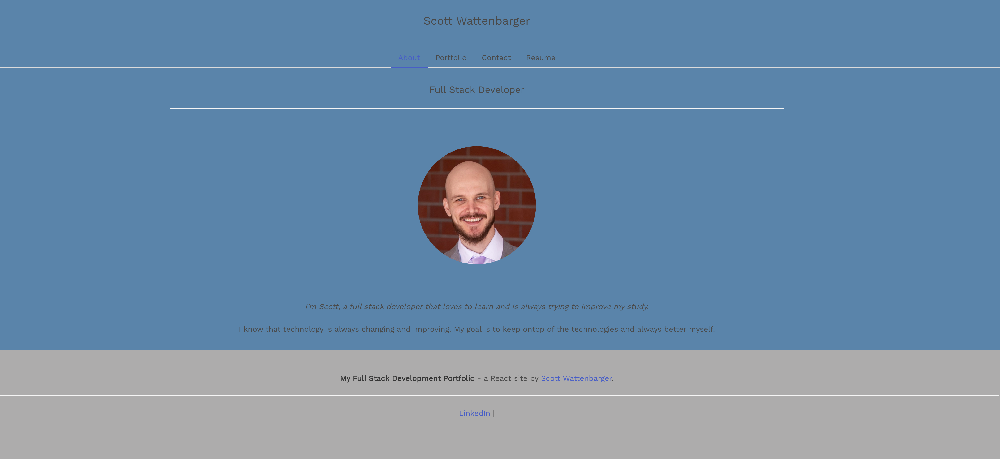

# React Portfolio Description
A react portfolio that shows off my work, linkedin, resume, and a contact me.

## Table of Contents
- [Live Site](#live-site)
- [Preview](#preview)
- [Tech Used](#tech-used)
- [Installation](#installation)
- [Usage](#usage)
- [Contribution](#contribution)
- [Questions](#questions)

### Live Site

https://scottwatt.github.io/react-portfolio/

### Preview 

### Tech Used

Dependencies: 
- "react": "^17.0.2",
- "react-dom": "^17.0.2",
- "react-scripts": "4.0.3",

## Installation 

`npm i`
`

## Usage 

`npm start`

## Questions
For questions reach out to me, [Scott Wattenbarger](https://github.com/scottwatt) by [linkedin](https://www.linkedin.com/in/scott-wattenbarger-057652123/).
